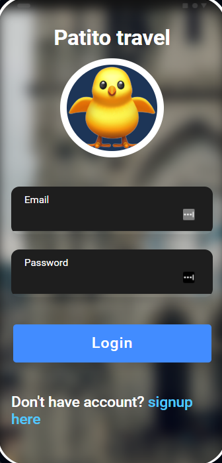

## Acerca del proyecto (Manual de usuario)
<div align="center">
    
</div>
   
### Herramientas
* [![Angular][Angular.io]][Angular-url]
* [![Ionic][Ionicframework.com]][Ionic-url]

## Getting Started

### Instalación (Manual de instalación)

1. Clona el repositorio
   ```sh
   git clone https://github.com/DanielGuachamin/proyecto-movil-1erbi.git
   ```
2. Instala las dependencias del proyecto
  	```sh
  	npm install 
  	```
 3. Levanta el servidor
 	```sh
  	ionic serve --lab 
  	```
## Anexos

Encuentra en el siguiente link como funciona la aplicación

* [LINK](https://choosealicense.com)

<!-- MARKDOWN LINKS & IMAGES -->

[Angular.io]: https://img.shields.io/badge/Angular-DD0031?style=for-the-badge&logo=angular&logoColor=white
[Angular-url]: https://angular.io/
[Ionicframework.com]: https://img.shields.io/badge/Ionic-0769AD?style=for-the-badge&logo=ionic&logoColor=white
[Ionic-url]: https://ionicframework.com/
[product-screenshot]: captures/pantallaInicio.png
